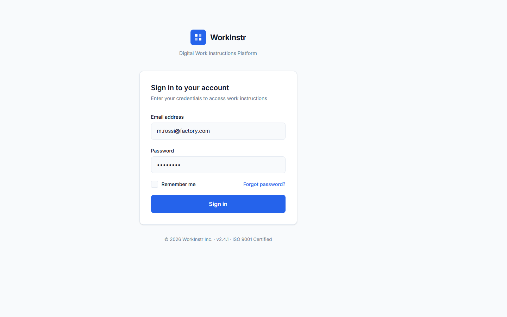
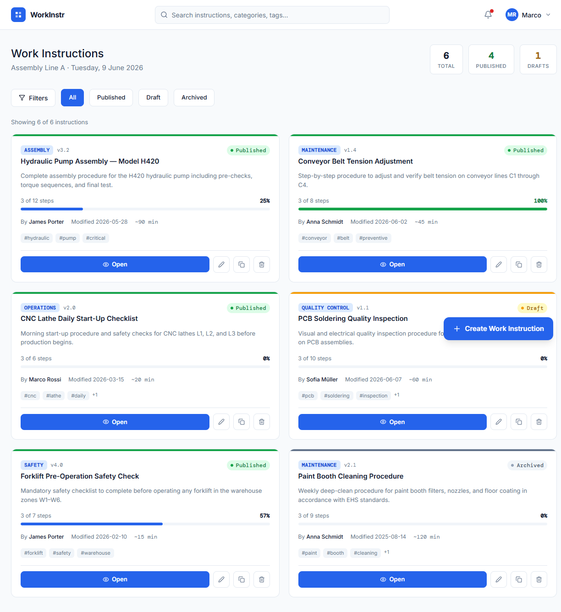

# Digital Work Instructions

A lightweight web application to create, manage, and execute digital work instructions for industrial operations.

It includes a simple login flow, a dashboard with filters and actions, an instruction editor, and a step-by-step viewer for execution.

## Tech Stack

- React + TypeScript
- Vite
- Tailwind CSS
- Radix UI components

## Main Flows

- Login screen
- Dashboard (search, filters, open/edit/duplicate/delete)
- Editor (instruction metadata and step management)
- Viewer (guided step execution with progress tracking)

## Screenshots

### Login

### Dashboard

